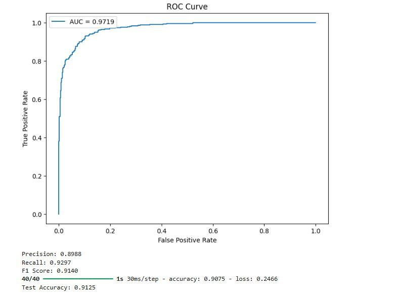
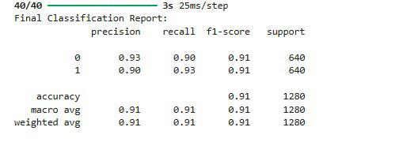

# Alzheimer-MRI-Classification-Model

Deep learning project for Alzheimer’s disease detection using MRI brain scans. Implements MobileNetV2 with transfer learning and Fusion Shot fine-tuning to classify disease stages. Built with TensorFlow and Keras, showcasing model training, evaluation, and performance visualization.

## Project Overview

Alzheimer’s disease is a progressive neurological disorder that requires early detection for better patient outcomes. This project leverages deep learning to automatically classify MRI brain scans into different stages of the disease. The model demonstrates high accuracy and provides visual insights into its predictions.

## How It Works

1. **Data Loading:** MRI images are loaded and preprocessed, normalized to a 224x224 resolution for compatibility with MobileNetV2.
2. **Model Architecture:** MobileNetV2 is used as a base model for transfer learning. Additional dense layers are added for classification.
3. **Training:** The model is first trained on frozen base layers, followed by fine-tuning using the Fusion Shot algorithm for improved performance.
4. **Evaluation:** Model performance is evaluated using confusion matrices, ROC curves, accuracy, precision, recall, and F1 score.
5. **Visualization:** Results are visualized to provide insights into model predictions and reliability.

## Tech Stack

- **Programming Language:** Python  
- **Frameworks/Libraries:** TensorFlow, Keras, Scikit-learn, XGBoost  
- **Visualization:** Matplotlib, Seaborn  
- **Hardware:** GPU acceleration supported via Google Colab  

## Results and Evaluation

### Confusion Matrix

### ROC Curve

### Accuracy and Other Metrics

## Future Improvements

- Expand dataset with more MRI scans for better generalization.  
- Implement data augmentation to reduce overfitting.  
- Explore advanced architectures like EfficientNet or 3D CNN for volumetric MRI data.  
- Deploy model as a web application for real-time Alzheimer’s detection.

## Open in Colab

You can view and run this project directly in Google Colab using the link below:

[Open Alzheimer-MRI-Classification-Model in Colab](https://colab.research.google.com/drive/1PAqIEbFVRWwwnc-bPzszbgWkVESmKrWT?usp=sharing)
